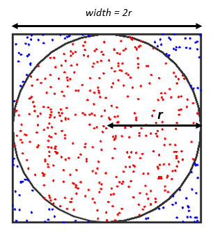

# Exercices pour cette séance

## Exo 1 - Passage de paramètres

* Ecrire un programme C++ qui prend un entier `n` en argument et qui lance `n` threads qui doivent afficher l'ordre dans lequel ils sont lançés. Le thread principal doit attendre la fin de chaque thread avant de retourner.

Exemple:
```bash
./exo2 5
Thread 1
Thread 3
Thread 4
Thread 5
Thread 2
```

* Faire un Makefile de manière à compiler cet exercice. Des exemples de Makefile sont disponibles dans `../cours1` ainsi que dans `../cours2/cours.md`. Le code doit pouvoir être compilé avec `make exo1` ainsi qu'avec simplement `make`.

**A partir de maintenant tous les exercices devront être compilés grâce à des Makefile.**

## Exo 2 - Utilisation de variable globale

* Ecrire un programme C++ qui prend un entier `n` en argument, déclare un `std::vector<int>` global et le remplit de la façon suivante:

`n` threads sont lançés, chacun doit choisir un entier (par exemple l'ordre avec lequel il est lançé) et l'écrire 3 fois dans le `vector` global.

Finalement le programme affiche le `vector` obtenu lorsque tous les threads ont fini.

Exemple:
```bash
./exo3 4
[1, 2, 2, 1, 1, 3, 3, 4, 2, 5, 3, 4, 5, 5, 4]
```

* Après cela, relancer `n` threads qui comptent le nombre d'apparitions de leur nombre assigné (par exemple leur ordre) et l'affiche.

```bash
./exo3 4
v = [1, 2, 2, 1, 1, 3, 3, 4, 2, 5, 3, 4, 5, 5, 4]
Count of 1 in v: 3
Count of 2 in v: 3
Count of 4 in v: 3
Count of 5 in v: 3
Count of 3 in v: 3
```

## Exo 3 - Calcul de Pi avec la méthode de Monte Carlo

* Ecrire un programme qui calcule Pi avec la méthode de Monte Carlo: on considère un carré 2x2 dans lequel est inscrit un cercle. Le but est de calculer Pi en simulant des lancers de fléchettes sur le carré.



On a donc:
```
Aire(cercle) = Pi
Aire(carré) = 2x2
ratio = Aire(cercle) / Aire(carré) = Pi / 4;
```

Ainsi si on calcule le ratio `Aire(cercle)/Aire(carré)` et qu'on le multiplie par 4 on obtient une approximation de Pi. Pour cela, lancer 100 000 des fléchettes (générer un point aléatoire de coordonnées entre -1 et 1) et regarder si elles tombent dans le cercle. Il suffit ensuite de diviser le nombre de lancers par le nombre de lancers qui atterrissent dans le cercle pour obtenir le ratio. Vérifier que l'on tombe bien sur Pi.

* Effectuer la même opération avec 10 threads parallèles